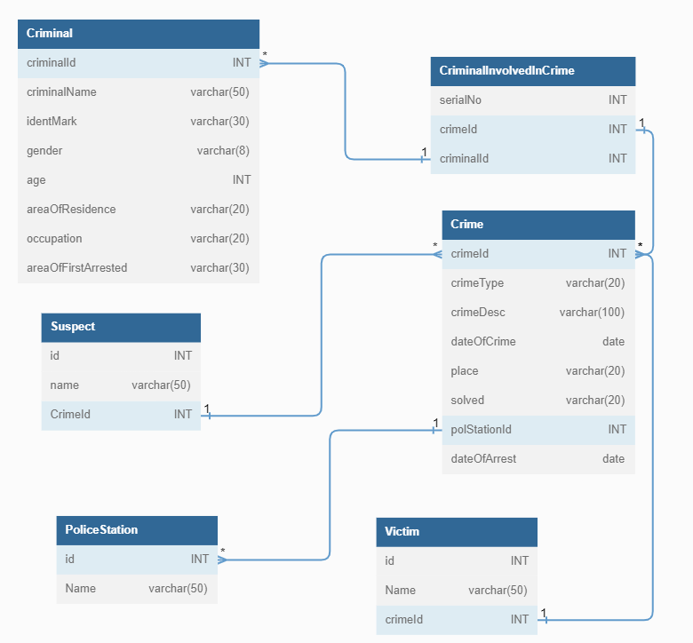

# Crime Files

Crime Files is a crime Information Management System that eases storing of crime information. It can store details regarding Crime, Criminals, Suspects, and Victims.

# Entity Relationship Diagram

<h2>Tech Stack</h2>
<ul>
 <li>Java</li>
 <li>JDBC</li>
 <li>MySQL</li>
</ul>

# Features

- Register A Crime
- Register A Criminal
- Add Suspects
- Add Victims
- Get Cases Related To A Concerned Police Station

# How To use this repo?

- git clone https://github.com/malonicester/lame-crayon-5872.git
- Open the Project in STS/Eclipse
- Use MySQL and change your database credentials in db.properties
- It is Command Line Application so no UI available
- run the App.java in the UI package
